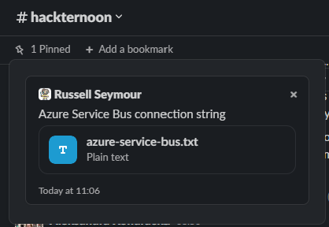

:icons: font
:icon-set: far
:page-background-image: image:images/page-image.png[position=top right]

# Hackternoon

[cols="2,1",frame=none,grid=none]
|===
a|Welcome to the first Hackternoon event. It should be fun and we should gets some apps that would be worth implementing to make our lives easier.

We would like you to work in your teams and come up with Slack app that can be pitched to our Dragons at the end of the day. The app can be anything you like, from sensible to silly, from the the sublime to the ridiculous. Here a few examples of things to get the ideas flowing:

a| image::images/hacker-toon.png[Hacker Toon,200,float=right,align=right]
|===

 * Office channel that knows who is in the office each day and reset at midnight
 * Submit support tickets through Slack
 * How long is the queue at x restaurant?
 * When is my next train home?
 * DALL E Image generator
    ** The Hacker Toon logo you see above was generated by the DALL E AI Image generator (https://labs.openai.com/) using natural language.

Obviously these ideas need to be worked through and ways of getting the data decided. Some of the data may be readily available in an API and some might not be so think about what you want to achieve and use everyone in the team wisely.

NOTE: Due to the number of people involved and access to Azure we do not have the ability to run the application in a pipeline or deploy it to an environment. It is expected that people will run demos on laptops and show a proof-of-concept of the app.

## Slack API

In order to be able to communicate with Slack you will need to create an app in Slack so that you have credentials to communicate with the platform. This can be done from the https://api.slack.com/apps[Slack API] page.

URL: https://api.slack.com/apps 

As the applications that are written will be behind a firewall the Slack App will need to use "Socket Mode"

image::images/slack-socket-mode.png[]

This can be configured in the App settings, in this case it is being set for the "Hackternoon" app. When you create your app please add in your team name.

## External APIs

It is expected that people will need to be able to access an external API at some point to get information to work with. Here is a list of sites that maybe of interest to you.

 * HiBob API - https://www.hibob.com/integrations/open-api/
 * National Rail Enquiries API - https://www.programmableweb.com/api/national-rail-enquiries
 * London Underground API - https://api.tfl.gov.uk/ 
 * Uber API - https://developer.uber.com/
 * Azure DevOps API - https://learn.microsoft.com/en-us/rest/api/azure/devops/?view=azure-devops-rest-7.1 
 * GitHub API - https://docs.github.com/en/rest 
 * DALL E OpenAI API - https://openai.com/api/
 * Weather API - https://www.weatherapi.com/
 * Pixabay API - https://pixabay.com/service/about/api/
   ** Royalty free images

Obviously you will need to look at these APIs to see what authentication is required and the calls that need to be made.

## Stacks

Where possible we would really appreciate it if you could use some of Stacks packages for .NET and Java. Each language has a set of capabilities that would be useful for building the Slack app.

 * .NET Web API - https://github.com/amido/stacks-dotnet
 * .NET Web API with CQRS and Events - https://github.com/amido/stacks-dotnet
    ** Using conditional compilation so it is possible to choose if to have events or not
 * Java Web API - https://github.com/amido/stacks-java
 * Java Web API with CQRS -  https://github.com/amido/stacks-java-cqrs
 * Java Web API with CQRS and Events-  https://github.com/amido/stacks-java-evnts

We do have a Service Bus setup in Azure if you would like to use it in your app. When creating topics please use the format,  `<team_name>_<app_name>`, for example, `team1_dalle`. The connection string for this is pinned in the main #hackteroon Slack channel.

## Source Control

So that all of the ideas that are developed can be kept and possibly developed at a later stage, a central mono-repo has been created. In the `src/` folder of this repo there are folders for each team, please create a branch off `main` and add your code into the relevant folder.

URL: https://github.com/amido/hackternoon_20221007

image::images/github-repo.png[]

NOTE: Please advise DevOps or TechOps if you have any issues accessing the repo.