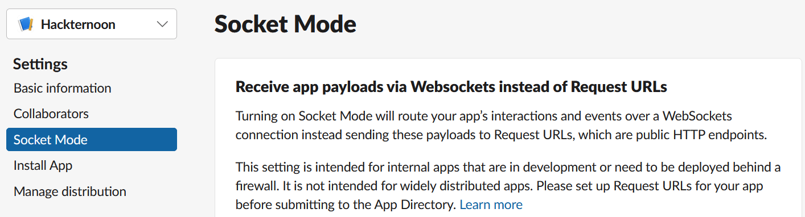
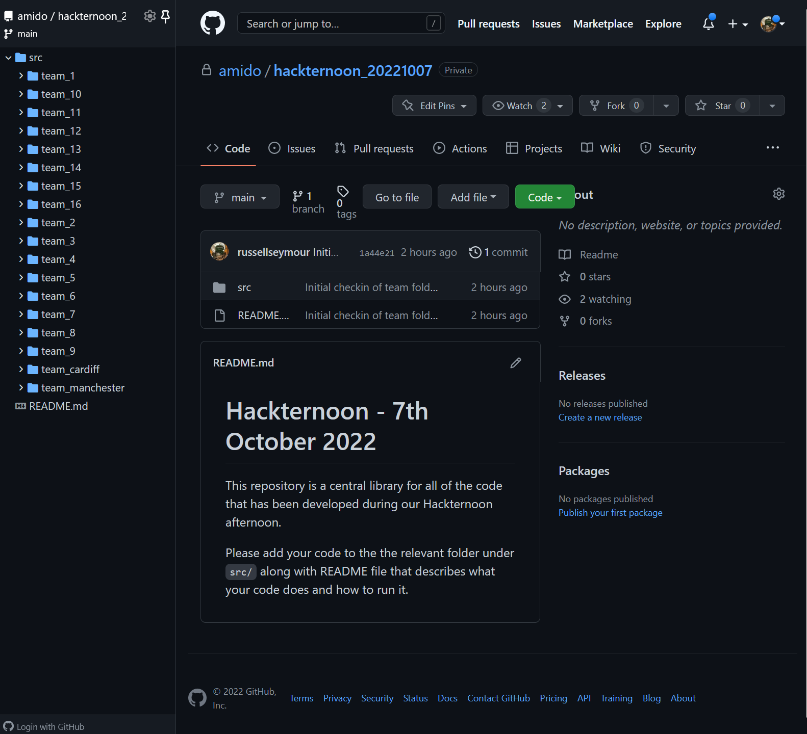

:icons: font
:icon-set: far
:page-background-image: image:images/page-image.png[position=top right]

# Hackternoon

[cols="2,1",frame=none,grid=none]
|===
a|Welcome to the first Hackternoon event. It should be fun and we should gets some apps that would be worth implementing to make our lives easier.

We would like you to work in your teams and come up with Slack app that can be pitched to our Dragons at the end of the day. The app can be anythign you like, from sensible to silly, from the the sublime to the ridiculous. Here a few examples of things to get the ideas flowing:

a| image::images/hacker-toon.png[Hacker Toon,200,float=right,align=right]
|===

 - Office channel that knows who is in the office each day and reset at midnight
 - Submit support tickets through Slack
 - How long is the queue at x restuarant?
 - When is my next train home?

Obviously these ideas need to be worked through and ways of getting the data decided. Some of the data may be readily availble in an API and some might not be so think about what you want to achieve and use everyone in the team wisely.

NOTE: Due to the number of people involved and access to Azure we do not have the ability to run the application in a pipeline or deploy them to an environment. It is expected that people will run demos on laptops and show a proof-of-concept of the app.

## Slack API

In order to be able to communicate with Slack you will need to create and App in Slack so that you have credentials to communicate with the platform. Tis can be done from the https://api.slack.com/apps[Slack API] page.

URL: https://api.slack.com/apps 

As the applications that are written will be behind a firewall the Slack App will need to use "Socket Mode"

This can be configured in the App settings, in this case it is being set for the "Hackternoon" app. When you create your app please add in your team name.

## Source Control

So that all of the ideas that are developed can be kept and possibly developed at a later stage, a central mono-repo has been created. In the `src/` folder of this repo there are folders for each team, please create a branch off `main` and add your code into the relevant folder.

URL: https://github.com/amido/hackternoon_20221007

NOTE: Please advise DevOps or TechOps if you have any issues accessing the repo.